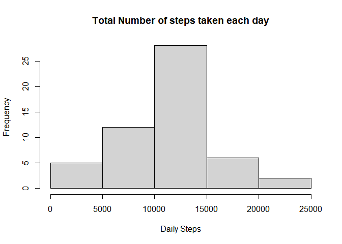
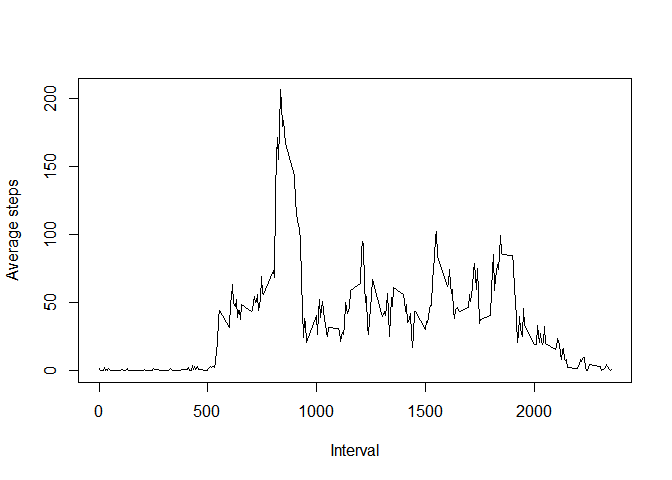
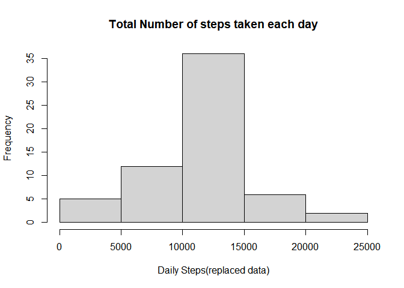
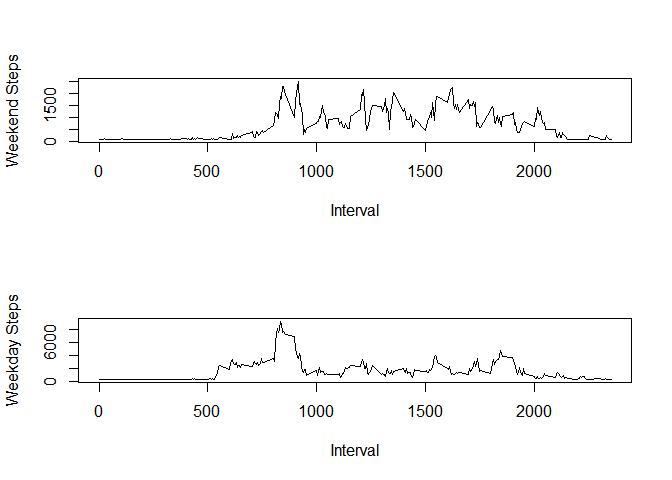

# Load and Process Data

```r
activity<-read.csv("activity.csv")
head(activity)
```

```
##   steps       date interval
## 1    NA 2012-10-01        0
## 2    NA 2012-10-01        5
## 3    NA 2012-10-01       10
## 4    NA 2012-10-01       15
## 5    NA 2012-10-01       20
## 6    NA 2012-10-01       25
```
# 1 Calculate  and report total number of steps per day

```r
activity_filter<- activity[!is.na(activity$steps),]

daily_steps<-aggregate(steps~date,activity_filter,sum)
daily_steps
```

```
##          date steps
## 1  2012-10-02   126
## 2  2012-10-03 11352
## 3  2012-10-04 12116
## 4  2012-10-05 13294
## 5  2012-10-06 15420
## 6  2012-10-07 11015
## 7  2012-10-09 12811
## 8  2012-10-10  9900
## 9  2012-10-11 10304
## 10 2012-10-12 17382
## 11 2012-10-13 12426
## 12 2012-10-14 15098
## 13 2012-10-15 10139
## 14 2012-10-16 15084
## 15 2012-10-17 13452
## 16 2012-10-18 10056
## 17 2012-10-19 11829
## 18 2012-10-20 10395
## 19 2012-10-21  8821
## 20 2012-10-22 13460
## 21 2012-10-23  8918
## 22 2012-10-24  8355
## 23 2012-10-25  2492
## 24 2012-10-26  6778
## 25 2012-10-27 10119
## 26 2012-10-28 11458
## 27 2012-10-29  5018
## 28 2012-10-30  9819
## 29 2012-10-31 15414
## 30 2012-11-02 10600
## 31 2012-11-03 10571
## 32 2012-11-05 10439
## 33 2012-11-06  8334
## 34 2012-11-07 12883
## 35 2012-11-08  3219
## 36 2012-11-11 12608
## 37 2012-11-12 10765
## 38 2012-11-13  7336
## 39 2012-11-15    41
## 40 2012-11-16  5441
## 41 2012-11-17 14339
## 42 2012-11-18 15110
## 43 2012-11-19  8841
## 44 2012-11-20  4472
## 45 2012-11-21 12787
## 46 2012-11-22 20427
## 47 2012-11-23 21194
## 48 2012-11-24 14478
## 49 2012-11-25 11834
## 50 2012-11-26 11162
## 51 2012-11-27 13646
## 52 2012-11-28 10183
## 53 2012-11-29  7047
```

# 2 Histogram of the total number of steps taken each day


```r
hist(as.numeric(daily_steps$steps),xlab = "Daily Steps",main = "Total Number of steps taken each day")
```

<!-- -->


# 3 mean and mediam numberof steps taken each day

```r
mean(daily_steps$steps)
```

```
## [1] 10766.19
```

```r
median((daily_steps$steps))
```

```
## [1] 10765
```

# 4 Time series plot of the average number of steps taken


```r
interval_agg<-aggregate(steps~interval,activity_filter,mean)

plot(interval_agg$interval,interval_agg$steps,type="l", xlab = "Interval", ylab = "Average steps")
```

<!-- -->

# 5 The 5-minute interval that, on average, contains the maximum number of steps

```r
interval_agg$interval[which.max(interval_agg$steps)]
```

```
## [1] 835
```

```r
interval_agg$steps[which.max(interval_agg$steps)]
```

```
## [1] 206.1698
```
Interval 835 contains the highest number of steps with 206.1698 steps


# 6 Code to describe and show a strategy for imputing missing data

 First we must identify which rows have NA values.
 


```r
na_idx<-is.na(activity$steps)
head(na_idx)
```

```
## [1] TRUE TRUE TRUE TRUE TRUE TRUE
```
Next we can calculate the average number of steps per interval to substitute for each row with NA

```r
steps<-activity$steps
mean(steps,na.rm = TRUE)
```

```
## [1] 37.3826
```
We can now replace all the missing values with the above average

```r
new_activity<-activity

new_activity[na_idx,1]<-37.3826
```

All missing values have now been replaced


# 7 Histogram of the total number of steps taken each day after missing values are imputed


```r
filled_data<- aggregate(steps~date,new_activity,sum)
hist(as.numeric(filled_data$steps),xlab = "Daily Steps(replaced data)",main = "Total Number of steps taken each day")
```

<!-- -->


# 8 Panel plot comparing the average number of steps taken per 5-minute interval across weekdays and weekends

```r
dw<-weekdays(as.Date(new_activity$date,'%Y-%m-%d'))
```


```r
new_activity[,2]<-dw
idx = new_activity[,2] == "Saturday" | new_activity[,2]=="Sunday"
weekend <- new_activity[idx==TRUE,]
weekdays<- new_activity[idx==FALSE,]

weekend_agg<- aggregate(steps~interval,weekend,sum)
weekday_agg<- aggregate(steps~interval,weekdays,sum)


par(mfrow=c(2,1))
plot(weekend_agg$interval,weekend_agg$steps,type = "l", xlab = "Interval",ylab = "Weekend Steps")
plot(weekday_agg$interval,weekday_agg$steps,type = "l", xlab = "Interval",ylab = "Weekday Steps")
```

<!-- -->

